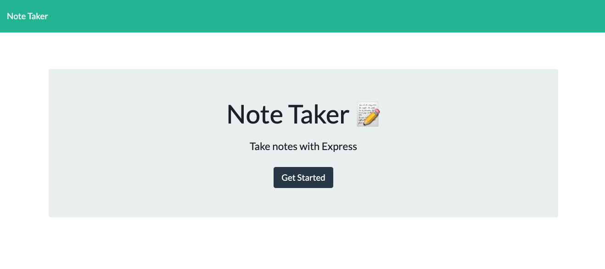

# Notetaker

Title: Notetaker

Developer: Francis Bond

Deployment Date: Feb 14, 2022

For: UT Coding Bootcamp

Published: GitHub 

Built with: Javascript, npm fs, Heroku,

## Summary

This application is run on Heroku and enables a user to write, save and delete notes through the server. 

Deployed project link : https://fb-notetaker.herokuapp.com/

## Development

Completing this assingment required me to follow the flow of information closely. Creating routes that took the proper information and manipulated it was key.